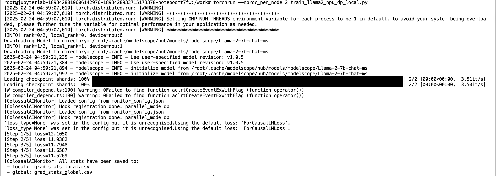
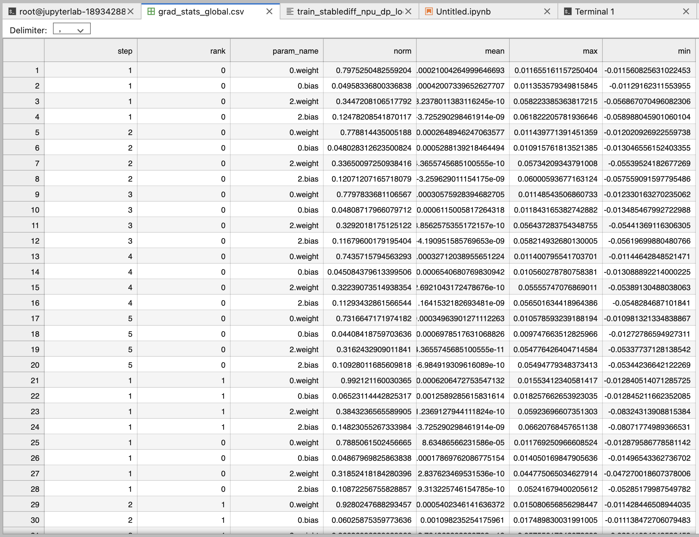
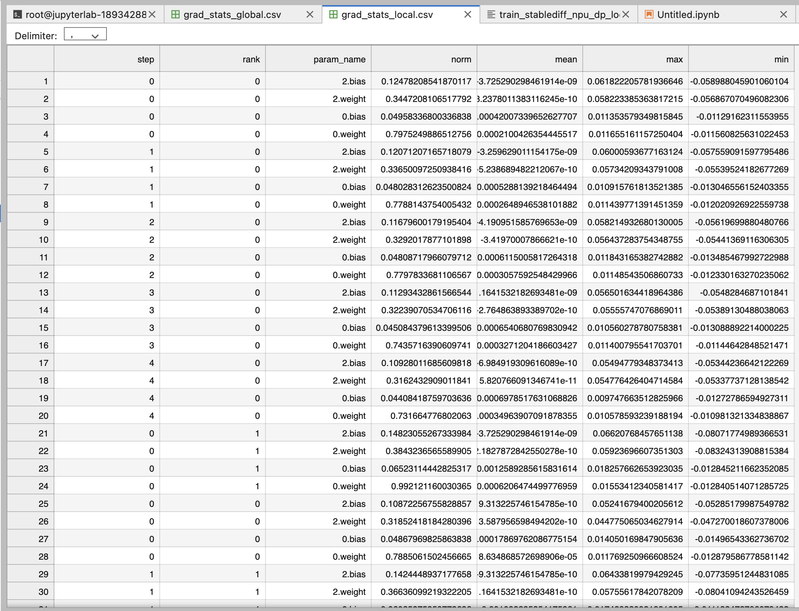

# ColossalAIMonitor

# 项目简介

本项目的核心是一个分布式训练梯度监控工具，可在不修改模型主体逻辑的前提下，通过 PyTorch Autograd Hook 记录各参数在**反向传播前（local）和反向传播后（global）**的梯度信息（包括 norm、max、min、mean 等统计）。其设计灵感来自华为 msprobe.monitor，并针对大规模并行训练场景（如 Colossal AI / PyTorch DDP 等）进行了通用化改进。

为满足比赛需求，我们使用本工具在 LLaMA2 (7B) 和 Stable Diffusion (v1.5) 上进行了实际验证：当开启 DP（数据并行）时，成功采集了“聚合前”的本地梯度，以及通过 AllReduce 后的“聚合后”全局梯度，并将结果输出到 CSV 文件中。这一过程证明了本工具在真实大模型训练中的适用性与正确性。


## 主要代码与文件

1. **monitor.py**  
   - 监控工具核心，定义 `ColossalAIMonitor`
   - `main`, `hook`
   - `step_end()`: 记录三合一模板
   - `stop()`: 写入剩余信息并关闭

2. **monitor_config.json**  
   - 监控配置文件  
   - 选项 `"front"`, `"max"`, `"min"`, `"mean"`  
   - `parallel_mode: "dp"`  
   - `output_dir`
   - 用户可根据自己的需要进行个性化的修改。

3. **train_llama2_npu_ddp_local.py**  
   - 测试脚本  
   - 使用 `ColossalAIMonitor` 在华为 Ascend + PyTorch DDP 下跑一个简单 LLM 训练（以比赛要求的 Llama2 模型为例）  
   - 训练中会打印损失 / labels，仅做 few steps 验证监控脚本可用

4. **train_stablediff_npu_ddp_local.py**  
   - 测试脚本  
   - 同理，测试 **Stable Diffusion (diffusers)** + DDP + `ColossalAIMonitor`，在 Ascend 环境下做最小化收敛测试  
   - 输入：`latents`, `text_embeds`，进行 forward/backward 并输出结果到 CSV

## 使用说明

### 1. 准备环境
- 确保 Ascend ToolKit（CANN 8.0等）和 `torch_npu` 安装完毕；
- 安装 `monitor.py` 所需的依赖（PyTorch-cpu + PyTorch npu）。

### 2. 在训练脚本中注入

**引入 ColossalAIMonitor：**
```python
from monitor import ColossalAIMonitor

monitor = ColossalAIMonitor("monitor_config.json")
monitor.monitor(model)  # 注册Hook
```

**每个 train step 后调用：**
```python
loss.backward()
optimizer.step()
monitor.step_end(model)
```

**训练结束后：**
```python
monitor.stop()
```

即可在脚本所在目录输出 grad_stats_local.csv & grad_stats_global.csv。

### 3. 查看输出

- **grad_stats_local.csv**：保存 `(step, rank, param_name, norm, mean, max, min)` 的本地梯度。  
- **grad_stats_global.csv**：保存同样字段的全局梯度。

### 4. LLaMA2 / Stable Diffusion 示例

- 参考 `train_llama2_npu_dp_local.py` 与 `train_stablediff_npu_dp_local.py`，只做“最小化”随机输入以测试 DP 模式下聚合前/后梯度分布是否能正确写入 CSV。


## 实践验证

### LLaMA2(7B)
在 Ascend NPU 环境中，以 PyTorch DDP 方式启动：

```bash
train_llama2_npu_dp_local.py
torchrun --nproc_per_node=2 train_llama2_npu_dp_local.py
```

运行数步后，会输出 grad_stats_local.csv & grad_stats_global.csv；对比各 rank 是否正确记录聚合前/后梯度统计，即可验证功能。






### Stable Diffusion
同样使用 train_stablediff_npu_dp_local.py 在 2 卡 DP 下做随机 backward，运行方法和llama2一致。
